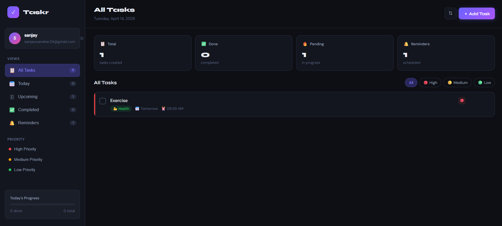
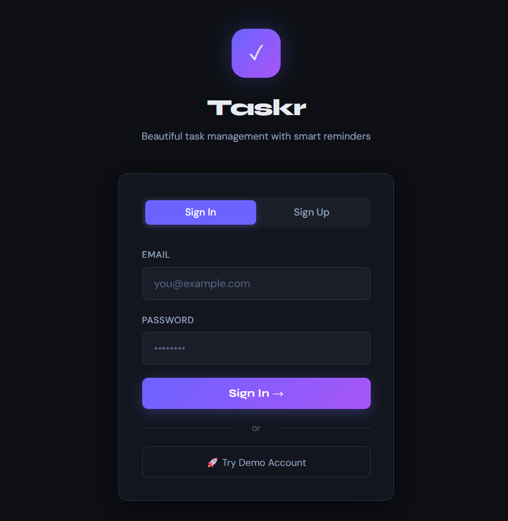

## 🌐 Live Demo

🔗 Live App: https://taskr-9vxvtihpu-sanjaywanekars-projects.vercel.app/  
🔗 API: https://tasks-to-do-app.onrender.com/tasks

# 🚀 Taskr — Full Stack To-Do App

A modern, feature-rich **full stack task management application** built using **HTML, CSS, JavaScript, and Python (Flask)** with persistent storage using **SQLite**.

---

## 📌 Features

* 🔐 User Authentication (Frontend-based)
* ✅ Create, Edit, Delete Tasks
* 🏷 Task Categories & Priority Levels
* 📅 Due Dates & Smart Filtering (Today, Upcoming, Completed)
* 🔔 Reminder System with Notifications
* 📊 Task Statistics & Progress Tracking
* 💾 Persistent Storage using SQLite
* 🌐 Full Stack Architecture (Frontend + Backend API)

---

## 🏗 Tech Stack

### 🔹 Frontend

* HTML5
* CSS3 (Custom UI)
* Vanilla JavaScript

### 🔹 Backend

* Python
* Flask
* Flask-CORS

### 🔹 Database

* SQLite

---

## 📂 Project Structure

```
03_To_Do_App/
├── index.html          # Frontend UI
├── app.py              # Flask backend
├── tasks.db            # SQLite database (auto-created)
├── requirements.txt    # Python dependencies
```

---

## ⚙️ Setup Instructions (Local Development)

### 1️⃣ Clone the repository

```
git clone https://github.com/sanjaywanekar/FSD-Projects/tree/main/03_To_Do-App
cd taskr-app
```

---

### 2️⃣ Install dependencies

```
pip install -r requirements.txt
```

---

### 3️⃣ Run backend server

```
python app.py
```

Server runs on:

```
http://127.0.0.1:5000
```

---

### 4️⃣ Run frontend

* Open `index.html` using **Live Server (VS Code)**

---

## 🔗 API Endpoints

| Method | Endpoint | Description   |
| ------ | -------- | ------------- |
| GET    | /tasks   | Get all tasks |
| POST   | /tasks   | Add new task  |
| DELETE | /tasks/  | Delete task   |

---

## 🚀 Deployment

### 🔹 Backend (Render)

* Deploy using:

  * Build Command: `pip install -r requirements.txt`
  * Start Command: `gunicorn app:app`

### 🔹 Frontend (Netlify)

* Upload `index.html`
* Replace API URL with deployed backend URL

---

## ⚠️ Important Notes

* Ensure backend URL is updated in frontend before deployment
* SQLite database is created automatically on first run
* Notifications require browser permission

---

## 📸 Screenshots
### 🏠 Dashboard


### ➕ Add Task

---

## 👨‍💻 Author

**Sanjay Wanekar**
B.Tech Computer Science & Design

---

## 🌟 Future Improvements

* 🔐 Backend Authentication (JWT)
* 🧑 Multi-user support
* ☁ Cloud database (MongoDB / PostgreSQL)
* 📱 Mobile responsive improvements
* 📈 Advanced analytics dashboard

---

## ⭐ If you like this project

Give it a ⭐ on GitHub and share it!

---
