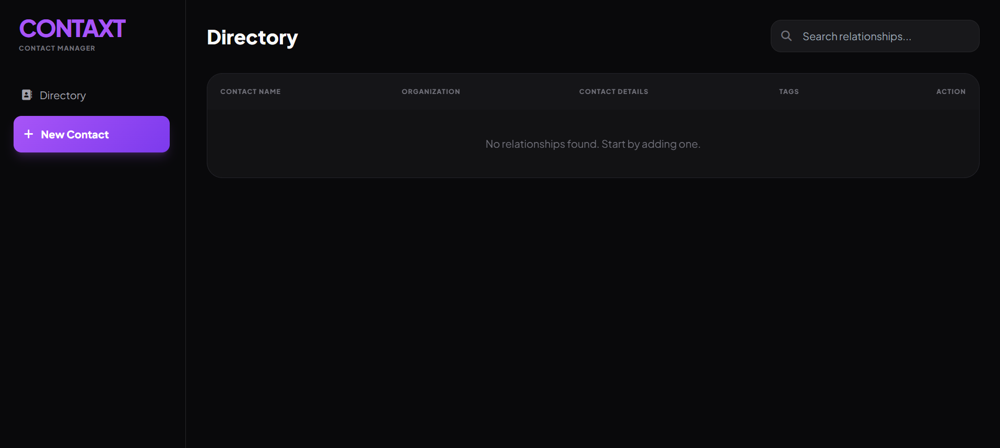
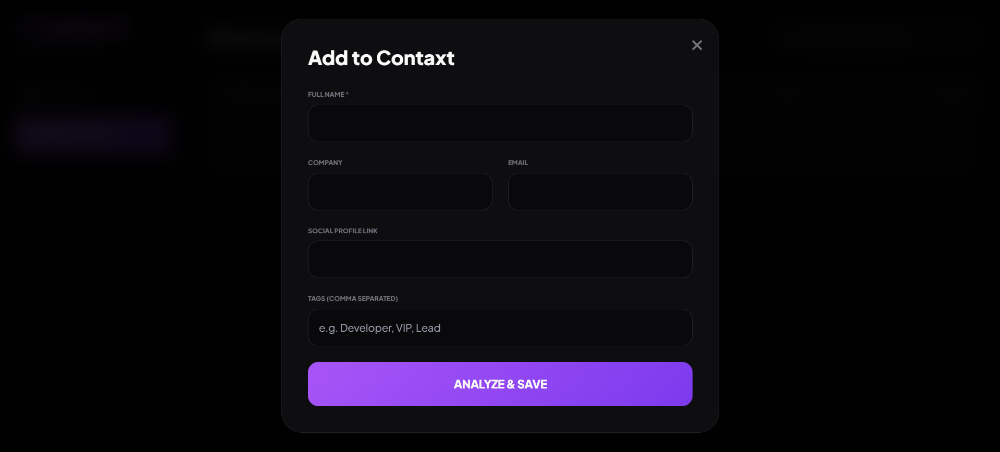

# CONTAXT | Contact Management System 🚀

**CONTAXT** is a high-performance, modern Contact Management System (CMS) designed with a focus on "Relationship Intelligence." Unlike traditional contact lists, CONTAXT allows users to categorize relationships using tags, link organizations, and store interaction context using a sleek, glassmorphic interface.

---

## 🌟 Key Features

- **Modern Glassmorphic UI:** A dark-themed, high-contrast dashboard built using the Tailwind CSS utility-first framework.
- **Dynamic Search Engine:** Real-time filtering system that allows users to search by Name, Company, or custom Tags.
- **Data Persistence:** Integrated with **Browser LocalStorage API** to ensure data remains persistent across sessions without the need for a server.
- **Categorization & Segmentation:** Advanced tagging system for targeted outreach and relationship grouping.
- **Fully Responsive:** Optimized for various viewport sizes using CSS Flexbox and Grid.

---

## 🛠️ Tech Stack

- **Frontend:** HTML5, JavaScript (ES6+)
- **Styling:** Tailwind CSS (via CDN)
- **Icons:** FontAwesome v6.4
- **Fonts:** Plus Jakarta Sans (Google Fonts)
- **Storage:** Web Storage API (LocalStorage)

---
## 📸 Screenshots

| Dashboard | Add Contact | 
|----------|------------|
|  |  |

## 📂 Project Structure

```text
CONTAXT/
│
├── index.html    # Main structure and UI layout
├── app.js        # Business logic and CRUD operations
└── README.md     # Documentation (this file)

🚀 Getting Started
To run this project locally, follow these steps:

Clone the repository:

Bash
git clone [https://github.com/YOUR_USERNAME/CONTAXT.git](https://github.com/YOUR_USERNAME/CONTAXT.git)
Navigate to the folder:

Bash
cd CONTAXT
Launch the App:
Simply open index.html in your preferred web browser (Chrome, Firefox, or Edge).

📊 Technical Implementation Details
CRUD Logic
The application implements Full CRUD (Create, Read, Update, Delete) functionality:

Create: Captures user input via a modal form and pushes objects into a central array.

Read: Maps the data array into the DOM using dynamic Template Literals.

Update/Search: Uses a .filter() method to provide instant search results based on multiple object properties.

Delete: Removes specific indices from the array and synchronizes the change back to LocalStorage.

Persistence Strategy
The data is stringified into JSON and stored in the user's browser:

JavaScript
localStorage.setItem('contaxt_pro_data', JSON.stringify(contacts));