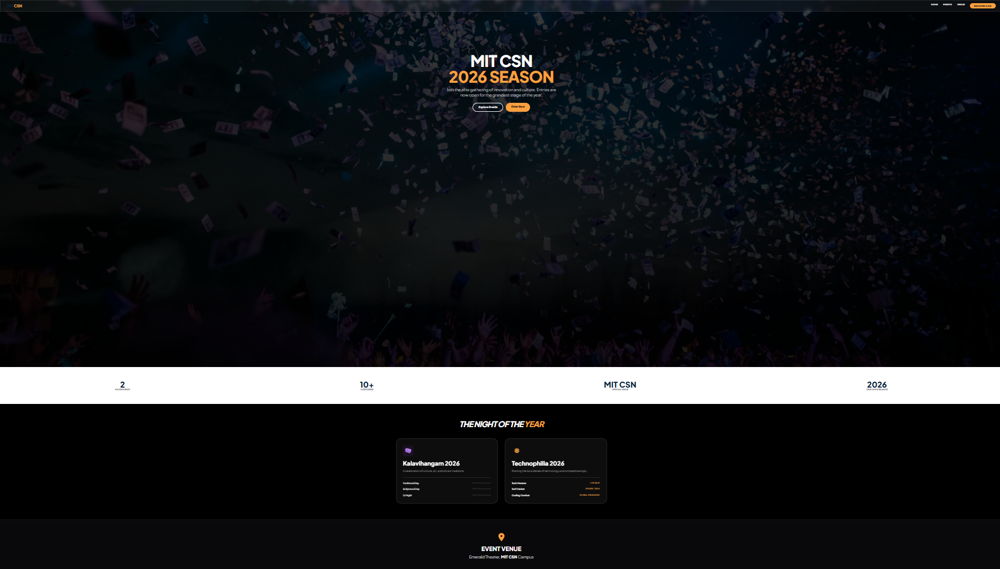
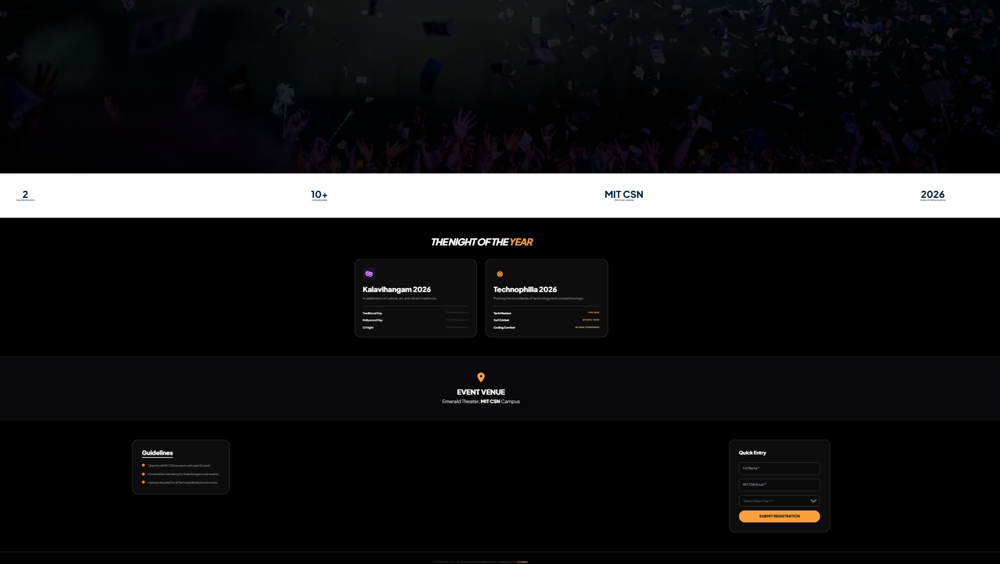

## 🌍 Live Website
👉 https://event-registration-website-gqp7.onrender.com/


# Event Registration Website  (MIT CSN Event Portal 2026)🎓

A premium, full-stack Event Registration System built for **MIT CSN**, inspired by high-end cinematic event platforms. This project serves as a central hub for the 2026 season of **Kalavihangam** and **Technophilia**, featuring a Python-driven backend and a brand-integrated frontend.

---

## 📸 Project Interface

| Landing Page (Hero) | Event Categories |
| :--- | :--- |
|  |  |

> **Brand Identity:** The interface is custom-themed using the official MIT CSN palette: **Deep Navy Blue (#0a2540)** and **Accent Orange (#f9a03f)**.

---

## 🚀 Key Features

- **Full-Stack Registration:** Connects a modern UI to a **Python/Flask** backend for real-time data handling.
- **SQL Persistence:** All registrations are programmatically stored in an **SQLite3** database (`mit_events.db`).
- **Dynamic Event Sections:** - **Kalavihangam 2026:** Focuses on cultural days (Traditional, Bollywood, DJ Night).
    - **Technophilia 2026:** Focuses on technical competitions (Tech Masters, Turf Cricket).
- **Responsive Architecture:** Built with **Tailwind CSS** for seamless performance across mobile and desktop devices.
- **Form Validation:** Client-side and server-side checks to ensure data integrity.

---

## 🛠️ Tech Stack

- **Backend:** Python 3.x, Flask Framework
- **Database:** SQLite3
- **Frontend:** HTML5, JavaScript (ES6+), Tailwind CSS (CDN)
- **Icons & Fonts:** FontAwesome 6, Plus Jakarta Sans
- **Styling:** Glassmorphism & High-Contrast Editorial Design

---

## 📂 Project Structure

```text
MIT_CSN_Project/
│
├── app.py              # Flask server & SQLite API logic
├── mit_events.db       # SQL Database (Created on first run)
├── static/             # Assets and client-side logic
│   ├── logo.png        # Official MIT CSN Logo
│   └── app.js          # Fetch API calls
└── templates/          
    └── index.html      # Main landing page & registration UI
---

## ⚙️ Installation & Setup
To run the MIT CSN Event Portal locally:

Clone the repository:

Bash
git clone [https://github.com/sanjaywanekar/FSD-Projects/tree/main/05_Event_Registration](https://github.com/sanjaywanekar/FSD-Projects/tree/main/05_Event_Registration)
Install Dependencies:

Bash
pip install flask
Run the Application:

Bash
python app.py
View the Site:
Open http://127.0.0.1:5000/ in your browser.

---

## 📊 Backend Logic (Intelligence Layer)
The system uses a POST request to send JSON data to the Python server:

JavaScript
const response = await fetch('/register', {
    method: 'POST',
    headers: { 'Content-Type': 'application/json' },
    body: JSON.stringify(registrationData)
});
The server then sanitizes the input and commits it to the SQLite table, ensuring that no registration is lost even if the server restarts.